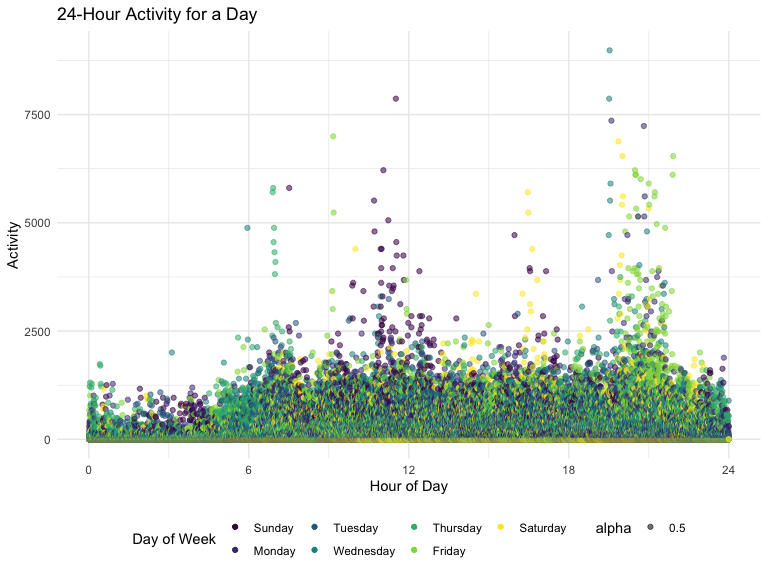
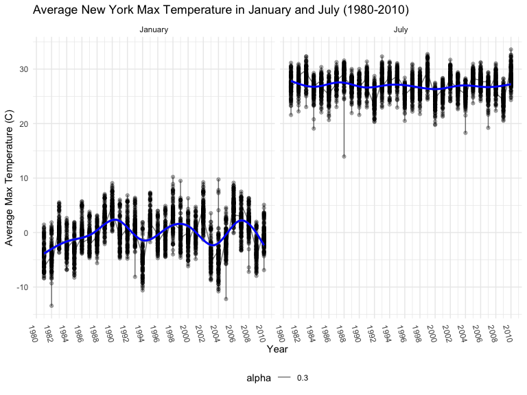

Homework 3
================

### Load packages

``` r
library(tidyverse)
library(ggridges)
library(patchwork)
library(readxl)
library(p8105.datasets)
library(patchwork)

knitr::opts_chunk$set(
    echo = TRUE,
    warning = FALSE,
    fig.width = 8, 
  fig.height = 6,
  out.width = "90%"
)

theme_set(theme_minimal() + theme(legend.position = "bottom"))

options(
  ggplot2.continuous.colour = "viridis",
  ggplot2.continuous.fill = "viridis"
)

scale_colour_discrete = scale_colour_viridis_d
scale_fill_discrete = scale_fill_viridis_d
```

## Problem 1

### Import Instacart data

``` r
data("instacart")
instacart <- 
  instacart %>% 
  as_tibble(.)
```

### Describe dataset

``` r
skimr::skim(instacart)
```

|                                                  |           |
|:-------------------------------------------------|:----------|
| Name                                             | instacart |
| Number of rows                                   | 1384617   |
| Number of columns                                | 15        |
| \_\_\_\_\_\_\_\_\_\_\_\_\_\_\_\_\_\_\_\_\_\_\_   |           |
| Column type frequency:                           |           |
| character                                        | 4         |
| numeric                                          | 11        |
| \_\_\_\_\_\_\_\_\_\_\_\_\_\_\_\_\_\_\_\_\_\_\_\_ |           |
| Group variables                                  | None      |

Data summary

**Variable type: character**

| skim_variable | n_missing | complete_rate | min | max | empty | n_unique | whitespace |
|:--------------|----------:|--------------:|----:|----:|------:|---------:|-----------:|
| eval_set      |         0 |             1 |   5 |   5 |     0 |        1 |          0 |
| product_name  |         0 |             1 |   3 | 159 |     0 |    39123 |          0 |
| aisle         |         0 |             1 |   3 |  29 |     0 |      134 |          0 |
| department    |         0 |             1 |   4 |  15 |     0 |       21 |          0 |

**Variable type: numeric**

| skim_variable          | n_missing | complete_rate |       mean |        sd |  p0 |    p25 |     p50 |     p75 |    p100 | hist  |
|:-----------------------|----------:|--------------:|-----------:|----------:|----:|-------:|--------:|--------:|--------:|:------|
| order_id               |         0 |             1 | 1706297.62 | 989732.65 |   1 | 843370 | 1701880 | 2568023 | 3421070 | ▇▇▇▇▇ |
| product_id             |         0 |             1 |   25556.24 |  14121.27 |   1 |  13380 |   25298 |   37940 |   49688 | ▆▆▇▆▇ |
| add_to_cart_order      |         0 |             1 |       8.76 |      7.42 |   1 |      3 |       7 |      12 |      80 | ▇▁▁▁▁ |
| reordered              |         0 |             1 |       0.60 |      0.49 |   0 |      0 |       1 |       1 |       1 | ▆▁▁▁▇ |
| user_id                |         0 |             1 |  103112.78 |  59487.15 |   1 |  51732 |  102933 |  154959 |  206209 | ▇▇▇▇▇ |
| order_number           |         0 |             1 |      17.09 |     16.61 |   4 |      6 |      11 |      21 |     100 | ▇▂▁▁▁ |
| order_dow              |         0 |             1 |       2.70 |      2.17 |   0 |      1 |       3 |       5 |       6 | ▇▂▂▂▆ |
| order_hour_of_day      |         0 |             1 |      13.58 |      4.24 |   0 |     10 |      14 |      17 |      23 | ▁▃▇▇▃ |
| days_since_prior_order |         0 |             1 |      17.07 |     10.43 |   0 |      7 |      15 |      30 |      30 | ▅▅▃▂▇ |
| aisle_id               |         0 |             1 |      71.30 |     38.10 |   1 |     31 |      83 |     107 |     134 | ▆▃▃▇▆ |
| department_id          |         0 |             1 |       9.84 |      6.29 |   1 |      4 |       8 |      16 |      21 | ▇▂▂▅▂ |

There are 1384617 observations and 15 variables in the `instacart`
dataset. Key variables include `order_hour_of_day`, `order_dow`,
`product_id`, `product_name`, `department`, `aisle`, and
`days_since_prior_order`. Each row is a single product within an order.
A total of 131209 orders, 39123 products,and 131209 unique users are
found in the dataset.

### Answering Questions

#### How many aisles are there, and which aisles are the most items ordered from?

``` r
instacart %>% count(aisle) %>% arrange(desc(n))
```

    ## # A tibble: 134 × 2
    ##    aisle                              n
    ##    <chr>                          <int>
    ##  1 fresh vegetables              150609
    ##  2 fresh fruits                  150473
    ##  3 packaged vegetables fruits     78493
    ##  4 yogurt                         55240
    ##  5 packaged cheese                41699
    ##  6 water seltzer sparkling water  36617
    ##  7 milk                           32644
    ##  8 chips pretzels                 31269
    ##  9 soy lactosefree                26240
    ## 10 bread                          23635
    ## # … with 124 more rows

There are a total of 134 aisles. Most items were ordered from the fresh
vegetables, fresh fruits, and packaged vegetables fruits aisles.

#### Make a plot that shows the number of items ordered in each aisle, limiting this to aisles with more than 10000 items ordered. Arrange aisles sensibly, and organize your plot so others can read it.

``` r
instacart %>% 
  count(aisle) %>% 
  filter(n > 10000) %>% 
  mutate(aisle = fct_reorder(aisle, n)) %>% 
  ggplot(aes(x = aisle, y = n)) + 
  geom_point() + 
  labs(title = "Number of items ordered in each aisle") +
  theme(axis.text.x = element_text(angle = 60, hjust = 1))
```


#### Make a table showing the three most popular items in each of the aisles “baking ingredients”, “dog food care”, and “packaged vegetables fruits”. Include the number of times each item is ordered in your table.

``` r
instacart %>% 
  filter(aisle %in% c("baking ingredients", "dog food care", "packaged vegetables fruits")) %>%
  group_by(aisle) %>% 
  count(product_name) %>% 
  mutate(rank = min_rank(desc(n))) %>% 
  filter(rank < 4) %>% 
  arrange(desc(n)) %>%
  knitr::kable()
```

| aisle                      | product_name                                  |    n | rank |
|:---------------------------|:----------------------------------------------|-----:|-----:|
| packaged vegetables fruits | Organic Baby Spinach                          | 9784 |    1 |
| packaged vegetables fruits | Organic Raspberries                           | 5546 |    2 |
| packaged vegetables fruits | Organic Blueberries                           | 4966 |    3 |
| baking ingredients         | Light Brown Sugar                             |  499 |    1 |
| baking ingredients         | Pure Baking Soda                              |  387 |    2 |
| baking ingredients         | Cane Sugar                                    |  336 |    3 |
| dog food care              | Snack Sticks Chicken & Rice Recipe Dog Treats |   30 |    1 |
| dog food care              | Organix Chicken & Brown Rice Recipe           |   28 |    2 |
| dog food care              | Small Dog Biscuits                            |   26 |    3 |

#### Make a table showing the mean hour of the day at which Pink Lady Apples and Coffee Ice Cream are ordered on each day of the week; format this table for human readers (i.e. produce a 2 x 7 table).

``` r
instacart %>%
  filter(product_name %in% c("Pink Lady Apples", "Coffee Ice Cream")) %>%
  group_by(product_name, order_dow) %>%
  summarize(mean_hour = mean(order_hour_of_day)) %>%
  spread(key = order_dow, value = mean_hour) %>%
  knitr::kable(digits = 2)
```

    ## `summarise()` has grouped output by 'product_name'. You can override using the
    ## `.groups` argument.

| product_name     |     0 |     1 |     2 |     3 |     4 |     5 |     6 |
|:-----------------|------:|------:|------:|------:|------:|------:|------:|
| Coffee Ice Cream | 13.77 | 14.32 | 15.38 | 15.32 | 15.22 | 12.26 | 13.83 |
| Pink Lady Apples | 13.44 | 11.36 | 11.70 | 14.25 | 11.55 | 12.78 | 11.94 |

## Problem 2

### Import and clean data

``` r
accel <- read_csv('data/accel_data.csv',
                  col_names = TRUE) %>%
  janitor::clean_names() %>%
  pivot_longer(
    activity_1:activity_1440,
    names_to = "minute",
    values_to = "activity"
  ) %>%
  mutate(
    day_of_week = factor(day, levels = c("Sunday", "Monday", "Tuesday", "Wednesday", "Thursday", "Friday", "Saturday"), ordered = TRUE),
    is_weekend = ifelse(day_of_week == c("Saturday", "Sunday"), TRUE, FALSE),
    minute = str_replace(minute,"activity_", ""),
    minute = as.numeric(minute),
    hour = minute/60
  ) %>%
  relocate(is_weekend, .after = day_of_week)
```

`accel` has a total of 50400 observations and 8 variables. Each row
contains accelerometer measurements for 24 hours. Variables include week
and day of measurement, whether the day was a weekend or not, and
accelerometer measurements for each minute of a 24 hour day starting at
midnight. This particular subject was tracked for 5 weeks or 35 days.

### Aggregate across minutes to create a total activity variable for each day, and create a table showing these totals

``` r
accel %>% 
  group_by(week, day_of_week) %>%
  summarize(total_activity = sum(activity)) %>%
  pivot_wider(
    names_from = "day_of_week",
    values_from = "total_activity"
  ) %>%
  knitr::kable(digits = 2)
```

    ## `summarise()` has grouped output by 'week'. You can override using the
    ## `.groups` argument.

| week | Sunday |    Monday |  Tuesday | Wednesday | Thursday |   Friday | Saturday |
|-----:|-------:|----------:|---------:|----------:|---------:|---------:|---------:|
|    1 | 631105 |  78828.07 | 307094.2 |    340115 | 355923.6 | 480542.6 |   376254 |
|    2 | 422018 | 295431.00 | 423245.0 |    440962 | 474048.0 | 568839.0 |   607175 |
|    3 | 467052 | 685910.00 | 381507.0 |    468869 | 371230.0 | 467420.0 |   382928 |
|    4 | 260617 | 409450.00 | 319568.0 |    434460 | 340291.0 | 154049.0 |     1440 |
|    5 | 138421 | 389080.00 | 367824.0 |    445366 | 549658.0 | 620860.0 |     1440 |

We see that on average, highest activity occurs during the weekday.
However, without additional analysis, any trends present within the data
is not obvious.

``` r
accel %>% 
  group_by(hour, week, day_of_week) %>%
  summarize(total_activity = sum(activity)) %>%
  ggplot(aes(x = hour, y = total_activity, color = day_of_week)) + 
  geom_point(aes(alpha = 0.5)) + 
  scale_x_continuous(
    breaks = c(0, 6, 12, 18, 24)
  ) +
  labs(title = "24-Hour Activity for a Day",
       x = "Hour of Day",
       y = "Activity",
       color = "Day of Week") +
  theme(legend.position = "bottom")
```

    ## `summarise()` has grouped output by 'hour', 'week'. You can override using the
    ## `.groups` argument.


Based on the graph, we see that the majority of activity counts per
minute are less than 2500. Interestingly, there is a spike in activity
at 12 PM some days between Monday to Thursday and another spike in
activity at around 7 PM - 10 PM between Thursday and Saturday.

## Problem 3

### Import NY NOAA data

``` r
data("ny_noaa")
ny_noaa <- 
  ny_noaa %>% 
  as_tibble(.)

skimr::skim(ny_noaa)
```

|                                                  |         |
|:-------------------------------------------------|:--------|
| Name                                             | ny_noaa |
| Number of rows                                   | 2595176 |
| Number of columns                                | 7       |
| \_\_\_\_\_\_\_\_\_\_\_\_\_\_\_\_\_\_\_\_\_\_\_   |         |
| Column type frequency:                           |         |
| character                                        | 3       |
| Date                                             | 1       |
| numeric                                          | 3       |
| \_\_\_\_\_\_\_\_\_\_\_\_\_\_\_\_\_\_\_\_\_\_\_\_ |         |
| Group variables                                  | None    |

Data summary

**Variable type: character**

| skim_variable | n_missing | complete_rate | min | max | empty | n_unique | whitespace |
|:--------------|----------:|--------------:|----:|----:|------:|---------:|-----------:|
| id            |         0 |          1.00 |  11 |  11 |     0 |      747 |          0 |
| tmax          |   1134358 |          0.56 |   1 |   4 |     0 |      532 |          0 |
| tmin          |   1134420 |          0.56 |   1 |   4 |     0 |      548 |          0 |

**Variable type: Date**

| skim_variable | n_missing | complete_rate | min        | max        | median     | n_unique |
|:--------------|----------:|--------------:|:-----------|:-----------|:-----------|---------:|
| date          |         0 |             1 | 1981-01-01 | 2010-12-31 | 1997-01-21 |    10957 |

**Variable type: numeric**

| skim_variable | n_missing | complete_rate |  mean |     sd |  p0 | p25 | p50 | p75 |  p100 | hist  |
|:--------------|----------:|--------------:|------:|-------:|----:|----:|----:|----:|------:|:------|
| prcp          |    145838 |          0.94 | 29.82 |  78.18 |   0 |   0 |   0 |  23 | 22860 | ▇▁▁▁▁ |
| snow          |    381221 |          0.85 |  4.99 |  27.22 | -13 |   0 |   0 |   0 | 10160 | ▇▁▁▁▁ |
| snwd          |    591786 |          0.77 | 37.31 | 113.54 |   0 |   0 |   0 |   0 |  9195 | ▇▁▁▁▁ |

`ny_noaa` contains weather data gathered from NY weather stations. There
are 2595176 observations and 7 variables. Each row is the daily
precipitation (mm), snowfall (mm), and temperature(C) gathered from a
weather station. There is extensive missing data in the dataset. Both
`tmax` and `tmin` are missing 44%, `prcp` missing 6%, `snow` missing
15%, and `snwd` missing 23% of observations.

### Clean and tidy data

``` r
ny_noaa <-
  ny_noaa %>%
  janitor::clean_names() %>%
  mutate(
    year = lubridate::year(date),
    month = lubridate::month(date),
    day = lubridate::day(date),
    snow = ifelse(snow == -13, NA, snow),
    tmax = (as.numeric(tmax))/10,
    tmin = (as.numeric(tmin))/10,
    prcp = prcp/10
  )
```

Most common observed values for snowfall:

``` r
ny_noaa %>%
  group_by(snow) %>%
  summarize(n = n()) %>%
  arrange(desc(n))
```

    ## # A tibble: 281 × 2
    ##     snow       n
    ##    <int>   <int>
    ##  1     0 2008508
    ##  2    NA  381222
    ##  3    25   31022
    ##  4    13   23095
    ##  5    51   18274
    ##  6    76   10173
    ##  7     8    9962
    ##  8     5    9748
    ##  9    38    9197
    ## 10     3    8790
    ## # … with 271 more rows

The top 5 commonly observed values of snowfall is 0, 25, 13, 51, and 76.
This is reasonable as most days in NY don’t experience snowfall and when
they do, only experience limited quantities.

Make a two-panel plot showing the average max temperature in January and
in July in each station across years. Is there any observable /
interpretable structure? Any outliers?

``` r
ny_noaa %>%
  filter(month %in% c(1,7)) %>%
  group_by(id, year, month) %>%
  summarize(mean_tmax = mean(tmax, na.rm = TRUE)) %>%
  ggplot(aes(x = year, y = mean_tmax), group = id) +
  geom_line(aes(alpha = 0.5)) +
  facet_grid(~ month, labeller = labeller(month = c("1" = "January", "7" = "July"))) +
  labs(title = "Average New York Max Temperature in January and July (1980-2010)",
       x = "Year",
       y = "Average Max Temperature (C)") 
```

    ## `summarise()` has grouped output by 'id', 'year'. You can override using the
    ## `.groups` argument.


laj;sdkfja;lskdfja;lskdfj

Make a two-panel plot showing (i) tmax vs tmin for the full dataset
(note that a scatterplot may not be the best option); and (ii) make a
plot showing the distribution of snowfall values greater than 0 and less
than 100 separately by year.

``` r
tmax_tmin <- 
  ny_noaa %>%
  ggplot(aes(x = tmax, y = tmin)) +
  geom_hex()
```

WATTTTT
